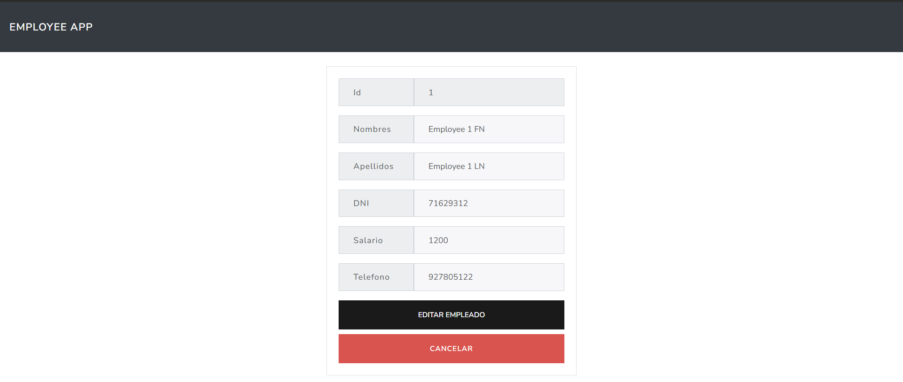

<p align="center"><a href="https://laravel.com" target="_blank"></a></p>

# Laravel Employees App

This is a **Laravel-based Employee Management System** that allows users to register, authenticate, and manage employee records.

## 🚀 Features
- **User Authentication** (Register, Login, Logout)
- **CRUD Operations for Employees** (Create, Read, Update, Delete)
- **Middleware for Authentication** to protect routes
- **MySQL Database Integration**

## 🛠 Tech Stack
- **Backend:** Laravel
- **Database:** MySQL
- **Authentication:** Laravel Auth
- **Routing:** Laravel Web Routes

## 📦 Installation
### Prerequisites
Ensure you have **PHP**, **Composer**, **MySQL**, and **Laravel** installed:
```sh
composer install
```

### Clone the repository
```sh
git clone https://github.com/your-username/employees-app.git
cd employees-app
```

### Set up environment variables
Copy `.env.example` to `.env` and update database credentials:
```env
DB_CONNECTION=mysql
DB_HOST=127.0.0.1
DB_PORT=3306
DB_DATABASE=laravel
DB_USERNAME=root
DB_PASSWORD=12345678
```

### Run migrations
```sh
php artisan migrate
```

### Start the server
```sh
php artisan serve
```
Access the application at `http://127.0.0.1:8000`.

## 📂 API Routes
| Method | Route | Description |
|--------|-------|-------------|
| **GET** | `/register` | Show registration form |
| **POST** | `/register` | Register a new user |
| **GET** | `/login` | Show login form |
| **POST** | `/login` | Authenticate user |
| **POST** | `/logout` | Log out user |
| **GET** | `/employees` | List all employees |
| **POST** | `/employees` | Create a new employee |
| **GET** | `/employees/{id}` | Show employee details |
| **PUT** | `/employees/{id}` | Update employee information |
| **DELETE** | `/employee/{id}` | Delete an employee |

## 📸 Preview

Here are some screenshots of the project in action:

### Employee List


### Update Form


### Login and register

<div align="center">
  
  
</div>


## 📜 License
This project is licensed under the **MIT License**. Feel free to use and modify it!